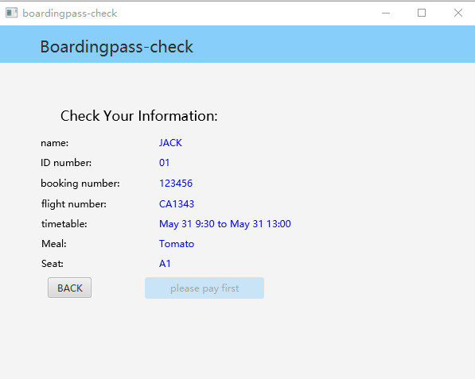

# Readme

## 0.Introduction
***We do recommend you to read the README file in markdown [here](README.md).***

The aim of this project is to develop a smart kiosks in front of its check-in desks at the Airport. To develop this system, we first have meetings to brainstorm for specific requirements. Then we use some fact-finding techniques such as interviews, observation, questionnaire and so on to make the requirements clear and accurate enough. Then we write java code through iterative development. At the end, we improve the user interface and produce some documents like user manuals. We hope every user of this software and our customer can be satisfied with this software.

### 0.1 Environment

| OS      | maven | junit | javafx | controlsfx | formsfx-core | validatorfx | ikonli-javafx | bootstrapfx-core | tilesfx | maven-compiler-plugin |  jdk| javafx-maven-plugin |configuration |
| ------- | ----- | ----- | ------ | ---------- | ------------ | ----------- | ------------- | ---------------- | ------- | --------------------- | ------------- | ------------------- |------------------- |
| Win_x64 | 4.0.0 | 5.8.1 | 15.0.1 | 11.1.0     | 11.3.2       | 0.1.13      | 12.2.0        | 0.4.0            | 11.48   | 3.8.1                 | 18.0.1            | 0.0.8               |15 |

## 1. Open

There are three ways to operate the program

#### 1.1 Open with source code

To open the system, open the folder with from your IDE and find the java file 'src/main/java/group16/smartflightcheckinkiosk/APP.java' and run it.

#### 1.2 Open with executable file 
You could get the executable file in our [release]() in Github, which will help you enjoy the software without any commanline input. 

#### 1.2.1 Open with .exe file

you can doubleclick the "SmartFlightCheckInKiosk.exe" to operate it

or use "cmd" and enter the directory, then run "start SmartFlightCheckInKiosk.exe" .

#### 1.2.2 Open with .jar file

you can doubleclick the "SmartFlightCheckInKiosk.jar" to operate it

or use "cmd" and enter the directory, then run "Java -jar SmartFlightCheckInKiosk.jar". While you have to make sure your jdk version is openjdk18.0.1.

## 2. Passenger Log In

Click passenger and then enter the passenger's login page. On this page, you can choose three ways to check-in

)

### 2.1 Log in

The first method is to click the first button" Booking Number" and you can enter the check-in of different people through the book number in the following table:

| 123456 | JACK |
| ------ | ---- |
| 123457 | ROSE |
| 123458 | TOM  |
| 123459 | MIKE |

The second method is to click the second button "Surname&ID number" and enter the surname and id number. You can enter the check-in of different people through the surname and ID number in the following table:

| ID number | Surname |
| --------- | ------- |
| 01        | JACK    |
| 02        | ROSE    |
| 03        | TOM     |
| 04        | MIKE    |

The third method is to click the third button and scan the id-card. We use the "login.csv" in the project as the id-card information entered by the passenger, so you can click ok to directly enter the subsequent interface, and click "back "at the bottom You can go back to the previous ChooseLogin interface.

### 2.2 Extra Options 

After logging in,  there is the main menu page, where you can see the booking information. The subsequent operations can be performed in the upper menu bar. 

First, you can directly return to the "ChooseLogin" page from Login-Quit. The second tab is "Choose" where passengers can choose meals and seats at Meal and Seat. The selected item button will turn blue.

The selected meal and seat and the amount to be paid can be seen in the third tab "Budget", enter the credit card number, click "ok" to pay, if the number is wrong, it will display "sorry, your car number is not correct" , if the balance is insufficient, it will display "sorry, your balance is not enough", if the payment is successful, it will display "successfully paid!O(∩_∩)O", and the text on the "ok" button will be grayed out and cannot be clicked.

 The table below shows passengers and their account numbers and balances

| Surname | Credit number | balance |
| ------- | ------------- | ------- |
| JACK    | 666           | 100.0   |
| ROSE    | 777           | 225.0   |
| TOM     | 888           | 200.0   |
| MIKE    | 999           | 100.0   |

_(If you want to test this function, you can enter the wrong number by entering the wrong number, or enter the correct number but select meals and seats that are out of balance)_

### 2.3 Boarding pass

The fourth tab is the last step of the passenger check-in boarding pass. First enter the interface called boardingpass-check, which will display the boarding information including the passenger's selected seat and meal information.

Note that you can click Next and print out the ticket and other information normally only after you have successfully paid the extra cost and selected your seat successfully.

 *If you want to test this error checking function:*

* *The situations where you cannot proceed to the next step includes: 1. Entering this interface without selecting a seat 2. When there are additional expenses that have not been paid*
* T*he situations where you can proceed to the next step includes: 1. When choosing a free seat such as A4 without ordering or paying for food 2. After successful payment of all additional expenses*

The second page is a notification page, notificating passengers that three items would be printed out:the boarding pass, the ticket corresponding to each check-in baggage, and the tag corresponding to each carry-on baggage

Click "ok" to print out the above items. There is a boardingpass window, each carry-on baggage corresponds to a boardingpass-tag window (with the tag name starting with CO), and each check baggage corresponds to a boarding-ticket window (with counter and tag name starting with CI) 

The following table shows the " owner, tag name, counter number, category" of each luggage

| owner | tag  | counter | type(1.check-in 2.carry-on) |
| ----- | ---- | ------- | --------------------------- |
| JACK  | CI1  | 01      | 1                           |
| JACK  | CI2  | 01      | 1                           |
| JACK  | CI3  | 02      | 1                           |
| JACK  | CO1  |         | 2                           |
| JACK  | CO2  |         | 2                           |
| JACK  | CO3  |         | 2                           |
| JACK  | CO4  |         | 2                           |
| ROSE  | CI4  | 01      | 1                           |
| ROSE  | CI5  | 01      | 1                           |
| TOM   | CI6  | 01      | 1                           |
| TOM   | CO5  |         | 2                           |

## 3. Staff

Click "Back" buttons until go back to the ChooseLogin page. Then click on "Staff" button to enter the first window of the staff system (Staff Login window).

The Staff system including StaffLogin, EnterFlight, CheckFlight and FlightList window.

This module allows staff to enter back-end system and inquire the information and check-in status of all passengers who have booked this flight. 

### 3.1 Staff login

After entering the staff login window, you can put in your staff ID and password to access the Back-end system.

You can use the following account to log in:

| Staff ID | Password |
| -------- | -------- |
| 123      | 456      |

### 3.2 Check flight information

After entering the back-end system, enter the flight number you want to query.

You can check the following flights:

| Flight number |
| ------------- |
| CA1343        |
| EC3434        |

### 3.3 Confirm your inquiry

To prevent similar flights from being queried due to incorrect input, please confirm the flight you want to query through the flight details.

### 3.4 Passenger list

After confirming the flight, check the passenger information and check-in status in the back-end  system. In order to check the overall check-in status, the kiosk will put the number of unchecked passengers in this flight at the bottom.

