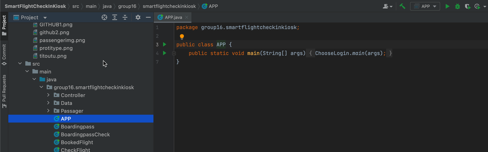
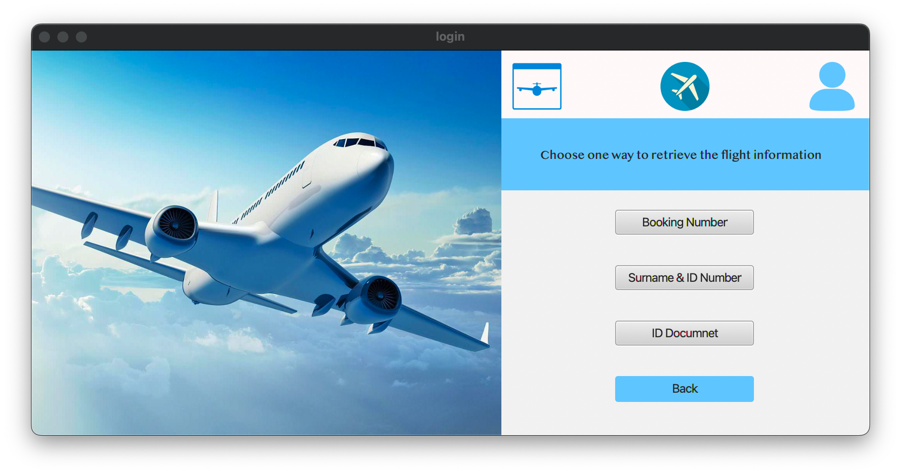
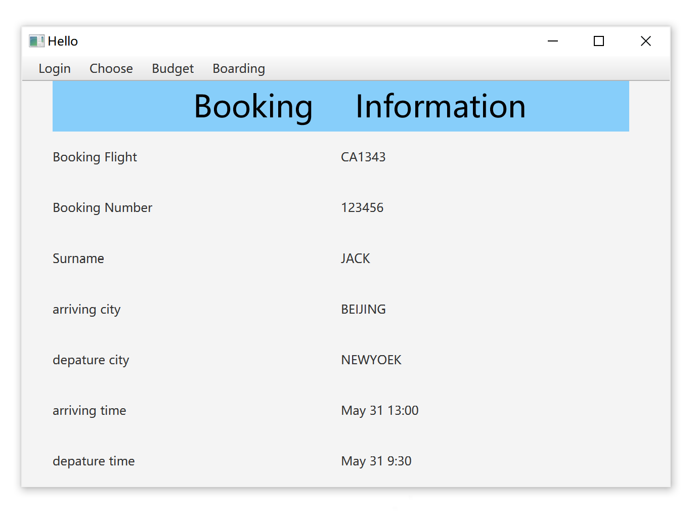

# User Manual

## I. Introduction

This is the user manual of the smart flight check-in kiosk. You can log in as a passenger or an airline staff to operate the system. 

As a passenger, you have three ways to check in to retrieve your flight booking information, and you can also choose special seating or meal and have an additional payment. 

As an airport staff, after logging in the system by your staff ID and password, you can enter the Back-end System. In this system, you can check the passengers information and check-in status in a particular flight.

## II. Start

To open the system, find the java file 'src/main/java/group16/smartflightcheckinkiosk/APP.java' and run it.

The output is the login GUI.

Press the Passenger button you will enter the passenger login GUI; press the Staff button you will enter the staff login GUI.

## III. Passenger Manual

### 1. Log in

After pressing the Passenger button, here is the passenger login GUI. The first three buttons are for the passenger to login, and if you want to quit this window, just press the 'back' button to go back to the first Login GUI.

We have store the information of passenger in the data.csv 'src/main/resources/group16/smartflightcheckinkiosk/data.csv'

This is the GUI of the first login way after pressing the "Booking Number" button. The available input are 123456, 123457, 123458, 123459 which you can check in the data.csv. 

This is the GUI of the second login way after pressing the "Surname & ID Number" button. The available surname are JACK, ROSE, TOM, MIKE, and the corresponding ID number are 01, 02, 03, 04 which you can check in the data.csv. 

This is the GUI of the third login way after pressing the "ID Document" button. First, you need to press the "confirm" button to ensure that you want to log in by using ID document otherwise there will be a warning. Then You can just press the "OK" button to jump to the next GUI since the system has already read the "data.csv" automatically.

### 2. Main manu

After logging in the system successfully, the main menu of the system will be shown and you can see the information of your booked flight. The system also print a sentence in the terminal if you login successfully.

Here are four buttons on the top-left corner of the panel. Ats for he first "Login" button, you can use it to go back to the very first login GUI.

### 3. Order

In the second block, there are two operations for you to choose special seat or meal.

Press the "Meal" button, and you can order food and close the window if you finish. The system will send you a message in the terminal if you order the food successfully.

Press the "Seat" button, and you can order seat and close the window if you finish. The system will send you a message in the terminal if you order the seat successfully.

### 4. Budget

Press the "Budget" button and check your payment. The available credit card numbers are 666 for JACK, 777 for ROSE, 888 for TOM, 999 for MIKE which you can check in the data.csv. 

If your balance is not enough to pay, the system will warn you.

If your budget is enough and pay the money successfully, the system will send you a success message and you can just press the "BACK" button to quit.

Check-in is complete when you have selected your seat and lunch and have completed payment. At this point, you can't choose a seat again and pay for it (the button will show "paid" after check-in is completed), but you can go into Boarding to see the information.

### 5. Boarding

Press the "Boarding" button to check your boarding information.

This is the boarding-check panel.

Press the "OK" button in the boarding check panel to the boardingpass loading panel. Here you can print your boarding pass, ticket and luggage tag. 

Press the "OK" button to print. Here is the boardingpass, ticket and tag. There may be several tags and tickets when passengers have some luggage.

Above is all the operations you can do in the passenger part of our flight system.

## Ⅳ. Staff manual

### 1. Log in

After entering the staff login window, you can put in your staff ID and password to access the Back-end system.

You can put 123 in Staff ID, 456 in Password for test.

### 2. Check flight information

After entering the back-end system, enter the flight number you want to query.

You can enter CA1343 for test.

### 3. Confirm your inquiry

To prevent similar flights from being queried due to incorrect input, please confirm the flight you want to query through the flight details. Click "next" to confirm your query.

### 4. View information

After confirming the flight, check the passenger information and check-in status in the back-end  system. In order to check the overall check-in status, the kiosk will put the number of unchecked passengers in this flight at the bottom. 

## Ⅴ. Other tips

### 1. Warning of input error

Whenever any invalid input including blank spaces, wrong numbers and characters is entered, a warning window will pop up to remind you and empty the input message. In this case, check the input information and enter it again.

### 2. Back button

At any time, when you need to query for additional information or services, click the "Back" button to return to the previous window.

### 3. Quit the application

At any time, click the cross button in the upper right corner to exit the program.

End.

#### Thank you for using our Smart Flight Check Kiosk ~
